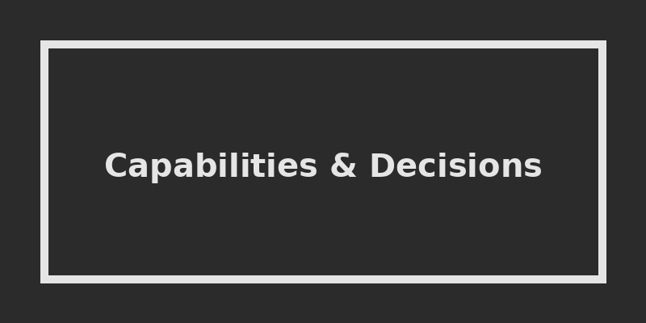

The technology world has undeniably turned its attention to AI coding assistants. This isn't a future prediction—it's already here. Enterprise leaders need to make critical decisions about the who, what, how, and why. One leading AI model company recently announced that 80% of its code—critical corporate assets and the lifeblood of their industry—is written by AI.

In this first part of a three-part series, I am sharing the capabilities, limitations, and my perspective on the effective management and usage of these tools. Subsequent posts will dive into patterns and what wrangling AI assistance looks like in practice.

## Teeing up with Individual Capabilities

Let's lay out some of the specific capabilities these tools possess, which sets the stage for putting them together later. This is particularly for those who haven't worked extensively with these tools. 

Note that I use "AI Coding Assistant" and various "AI agents" interchangeably here. In many contexts, these capabilities go beyond simple assistance into *specialized agency*—software actively doing things with knowledge and intention.

### Writing Code and Beyond
AI coding assistants can write code—no sweat. Code is just structured language, and these assistants are backed by powerful large language models (LLMs). But the reality is that we define far more than just web pages with code today. Back-end APIs, cloud infrastructure, security policies, network configurations, and even the instructions for other agents are all code. Anything in your technical environment expressed in a formatted file or connected via an API is fair game.

### Using Tools
These are first-class agents that can run tools. Tools exist for almost all modern platform functions: cloud deployments, database management, issue tracking, and quality testing. Some tools can even interpret screens where APIs don't exist. With the right permissions, coding agents can operate these seamlessly.

### Designing Workflows
With enough context, AI coding assistants can design end-to-end flows. Based on established software patterns, an LLM can figure out the necessary system components, the roles for each, and how they wire up together.

### Following Instructions
This is where it can get wild. These tools often start up and look for instruction files as a guide. Instructions steer the flow of events—dictating that code must be tested, logging decisions, or enforcing regression tests. Success depends heavily on how well aligned the instructions are to the tasks at hand. Well-written instructions must be unambiguous. For example, "always write a regression test when a bug is fixed"—does that mean bugs you found, the assistant found, or both? Precision is key.