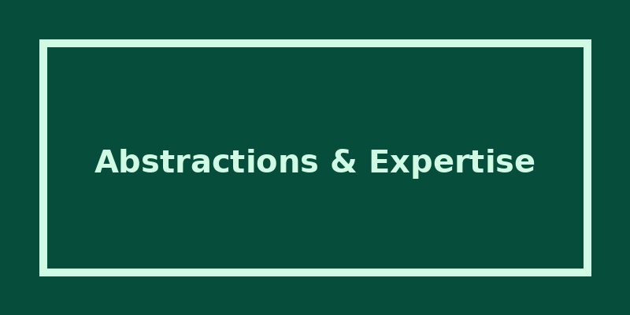

This final post in our series explores the operational abstractions needed to manage fleets of AI coding agents, and the evolving human skills required to guide them effectively.

## Abstractions for Multi-Agent Workflows

Working with AI agents pushes the software development lifecycle further towards end-to-end automation. Through iteration, I created four reusable frameworks for different scenarios:

1. **The Single Repo Script**: Ideal for small apps. Define the sprint in `.github/copilot-instructions.md` and tell the agent to follow a runbook. Prompt it with boilerplate sprint goals and acceptance criteria, acting as an Agile scrum master.
2. **Enterprise Fleet Controller**: For multi-repo applications. One agent coordinates design and work items, while specialist agents write code and deployment procedures. Critic agents provide continuous checks and balances.
3. **Submodule Coordinator**: An alternative multi-repo approach where a parent repository tracks layers as git submodules. However, keeping the scope limited to avoid token exhaustion is challenging. Coordinator agents often micromanage instead of delegating, leading to compromised quality and effort.
4. **Custom Workflows**: Still a work in progress. Using AI to design deterministic gates that temporarily control indeterministic agents shows promise, but requires further refinement to be fully reliable.

## The Shift in Human Expertise

Projecting these experiments into the real world uncovers a shift in essential roles and skills. With these skills, ideas take off incredibly quickly. Without them, teams will spin in circles wasting time and tokens.

- **Vision Casting**: This initiates the process. The clearer the vision, the faster the AI brings it to life.
- **Written Communication**: Concise language and ambiguity removal are vital. You must understand how AI receives and processes text, realizing that AI reads structured formats much easier than prose.
- **Software Tooling**: Knowing how to run, format, test, deploy, and secure code. Triggering these tools at the right time without having the AI design them from scratch saves massive amounts of tokens.
- **Systematic Feedback**: Gathering feedback systematically from users and the system to feed improvements and fixes back to the agents.
- **Managing Scope**: Starting with clear definitions and enforcing boundaries on your agents' memories and processing abilities, much like managing human developers.
- **Software Integrations**: Understanding how components wire together ensures the system flows correctly. This is critical for troubleshooting complex bugs and enabling self-diagnostics.

## Where to Put Your Money Right Now

Based on current technology, AI excels at specific language-driven tasks:

- **Writing Code**: Putting the "language" back in programming languages. It's a natural fit for Python, HTML, and Infrastructure as Code like Terraform.
- **Gap Analysis**: AI is remarkably good at critical analysis. If you provide the right context and ask what you're doing wrong, it will tell you.
- **Technical Flow Design**: Handling how data flows from a screen to an API to a database is managed well, provided your instructions are systematic.

The human skills highlighted above aren't found in a single traditional job description. They require soft skills, imagination, and abstract thinking. Yet, the fundamentals of software engineering are more important than ever. We are on the cusp of inventing a completely new shape for getting from idea to deployment.