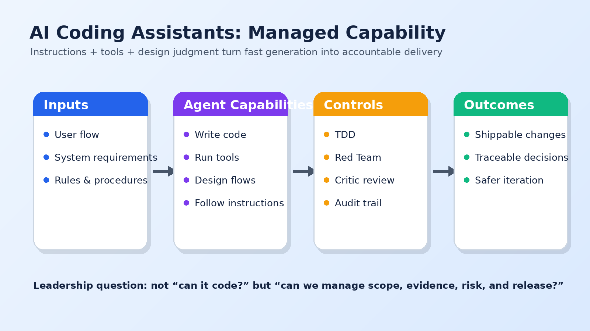

The technology world has turned to AI coding assistants. It is here. It is not "going" to happen because it already has. Enterprise leaders now need to make decisions about who, what, how, and why. You know, the usual suspects of any major decision.

This is timely because one leading AI model company recently said that 80% of its code is written by AI. Critical corporate assets. The lifeblood of that industry. That should get our attention.

This post is part 1 of a three-part series. Here I am laying out capabilities, limitations, and a management lens for using these tools well. The next posts move into operating patterns and then the human skills that matter most when the assistant can do a lot, but not everything.

## Teeing Up the Capabilities

Let's level set with the people who have not worked much, or at all, with these tools.

I use "AI coding assistant" and "agent" almost interchangeably here. Most of the time, the capability goes beyond an assistant that suggests a line of code. We are talking about specialized agency: software doing work with knowledge, tools, and intention.

AI coding assistants can write code. Sure. No sweat. Code is language after all, and these assistants are backed by serious large language models. But the bigger point is that we define far more than web pages with code. Back-end APIs, cloud infrastructure, security policy, network configuration, database migrations, deployment workflows, and even other agents are all expressed in structured files or reachable through APIs and tools.

In other words: anything in your technical environment that is expressed as text, represented by configuration, or connected to through a tool is fair game.

That is the shift.

## Agents Run Tools

So let's build on that, because these are first-class agents. They run tools.

Tools exist for just about every function of modern platforms: clouds, databases, issue tracking systems, quality testing, security scanning, package management, observability, and deployment. Some tools are even smart enough to work from screens where a clean API does not exist. Coding agents can be permitted to run these tools, observe results, and adjust their work.

That makes the assistant less like autocomplete and more like a junior engineer with a shell, a checklist, and a very fast typing speed.

That is powerful. It is also where management discipline starts to matter.

A coding assistant with tool access can create, modify, test, deploy, and debug. If the instructions are clear, it can move quickly through a workflow. If the instructions are vague, it can also move quickly in the wrong direction. Fast wrong is still wrong. Sometimes it is expensively wrong.

## Agents Can Design Flows

With enough of a clue for input, coding assistants can design end-to-end flows. Based on established patterns written about by people like me sharing all our knowledge for free, an LLM can reason through the system components needed, the roles each component should play, and how they wire together.

A prompt that starts with a user journey can become a technical architecture. A screen action can become an API contract. An API contract can become a database schema. A database schema can become migrations, validation rules, test cases, and deployment steps.

That does not mean you should accept the first answer. It means the assistant can produce a plausible first design quickly enough that the human job changes. You are not starting from a blank page. You are reviewing, correcting, constraining, and asking the system to prove it did the thing it claimed to do.

## Instructions Are a Capability Too

I'll tack on "follow instructions" as a capability, though this is where it can get a little wild.

These tools are built to start up and look for instruction files as their guide. Instructions can steer the flow of events: code must be tested before moving to the next step, all decisions must be logged, a regression test must be kept when a bug is found, risky changes need a review pass, and deployments need explicit gates.

Compliance depends on how well aligned the instructions are to the work the assistant encounters. Good instructions fire in different contexts. Weak instructions fire only when the exact scenario appears.

For example: "always write a regression test when a bug is fixed" sounds clear until you ask what counts as a bug. Bugs the assistant finds? Bugs the user reports? Bugs exposed by a failing test? Bugs in generated code? All of the above?

This is why instruction writing becomes a leadership and engineering skill. It is policy, procedure, and architecture in miniature.

## Putting Capabilities Together

You probably already connected the dots, so I will sum this up.

1. Give the AI coding assistant rules and procedures.
2. In a standard way, describe ideas as flows of interaction between a user and the system.
3. Let AI produce a technical design and break work across repositories or layers.
4. Use a Red Team agent to identify cybersecurity risks and force mitigations into the design.
5. Have AI build and test against the specification.
6. Use a critic agent to validate that the coding agent actually did what it was supposed to do.
7. Use a deployment agent to deploy each layer: cloud, API, web, mobile, data, and so on.
8. Feed logs and user feedback back into the next improvement cycle.

The keywords matter:

- **Red Team:** from cybersecurity, meaning a team that finds risks and drives mitigations. In this context, an iterative loop between a Red Team agent and a design agent can harden a system before implementation.
- **TDD:** test-driven development. This makes the agent define the target before writing the implementation. In real life, TDD kept us from skipping automated testing and clarified ambiguity. Same thing here, only faster.
- **Critic:** an agent that evaluates what something should be versus what it is, then gives candid feedback like it wants a podcast.
- **Infrastructure as Code:** using versioned files instead of ad hoc commands so agents can define, review, and deploy cloud resources through repeatable patterns.

## The Management Problem

The question is not whether AI coding assistants can do useful work. They can.

The question is whether the organization can manage the work. Can we define scope clearly? Can we give the assistant the right tools and no more? Can we test the result? Can we audit the decisions? Can we stop the system when it is confidently wrong?

That is where enterprise leaders should focus. The assistant is not a strategy. The assistant is capacity. Strategy is deciding where that capacity should point, what guardrails it needs, and how to know when the result is good enough to ship.

Used casually, these tools are impressive. Used systematically, they are a new delivery model trying to be born.
