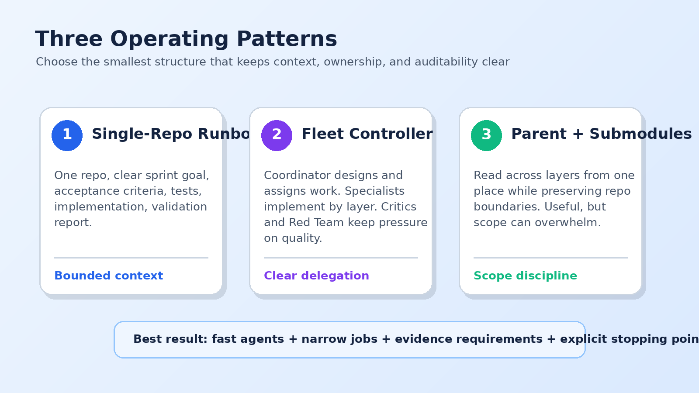

Over the last couple of months I have been zealously figuring out how best to work with AI coding assistants as if I were writing enterprise or commercial software.

But I did not write code. Not a line.

That was the test: can GitHub Copilot write code that maintains quality, adheres to standards, takes traceable and auditable actions, and follows a logical workflow?

Yes. Not to understate it, but yes.

It takes a good manager, but yes. It was also exhausting at times. Think 15-minute follow-ups instead of daily standups with a human team. Different rhythm. Same need for clarity.

## What I Actually Did

My role was to set up coding assistants to do the work.

That meant I:

- Communicated the flow from the user perspective.
- Wrote system requirements and made the assistant refer back to them.
- Set up tasks where the assistant had no tools, such as logging in to Apple and Google developer sites, so the human handoff was explicit.
- Reviewed code and log files when AI could not fix a problem quickly.
- Steered the assistant back to scope when it wandered.

The outcomes ranged from fully functional to almost-there-but-stuck-in-break-fix loops until I stepped back and looked at my approach.

That step back was the important part.

The issue was not whether the assistant could write code. The issue was how to organize the work so the assistant could succeed without drowning in context, ambiguity, or tool access it did not need.

## The Apps I Used as Test Beds

I used real application ideas with enough complexity to expose the seams.

One translated natural language into math formulas, ran them, and tuned for efficiency. That included a web firewall, website, agent, and tools.

Another analyzed a resume against a job description and rewrote it in the language of the target employer. That included a web firewall, website, Android app, API, database, and agent.

A third remembered what TV shows I was streaming. That touched a web firewall, website, Android app, Alexa integration, iOS app, and database.

These were not toy prompts asking for a calculator. They had layers. They had integration points. They had enough moving pieces to make the management pattern matter.

## Pattern 1: The Single-Repo Runbook

For a small app with one repository, the simplest working pattern is a runbook.

Define the sprint in an instruction file. Tell the assistant to follow an operator runbook. Prompt it with sprint goals and acceptance criteria as if you were an Agile scrum master who had suddenly become very particular about evidence.

The assistant needs a clear loop:

1. Read the sprint goal.
2. Confirm the acceptance criteria.
3. Identify the files and tests likely to change.
4. Write or update tests first where practical.
5. Implement the change.
6. Run the existing validation commands.
7. Report what changed, what passed, and what remains risky.

This works because the context is bounded. The assistant can see the repository, understand the conventions, and complete a vertical slice without pretending it is also the cloud architect, mobile lead, release manager, and security team.

For small work, keep it boring. Boring is good. Boring ships.

## Pattern 2: The Enterprise Copilot Fleet Controller

For applications with multiple repositories, one per layer, I used what I called the Enterprise Copilot Fleet Controller.

One coordinator agent owns design and work items. It does not write all the code. That is the trap. It coordinates.

Specialist agents work in their own repositories: cloud, API, web, mobile, data, or integration. Critic agents review outputs. A Red Team agent challenges the design. Deployment agents handle release procedures with the right access.

This pattern is closer to real enterprise delivery. Each agent has a job. Each job has a boundary. Each boundary reduces the chance that one giant context window becomes a junk drawer full of everything.

The fleet controller pattern also makes auditability easier. Design decisions live in one place. Implementation happens in the right layer. Reviews and deployment steps can be traced back to the work item that caused them.

Any managers in the room right now, feeling that?

## Pattern 3: The Parent Repository With Submodules

The alternative multi-repo pattern was a parent repository that tracked each layer as a git submodule. The coordinator could read across layers from one place while individual repositories still preserved ownership.

This worked better than I expected for a while. The assistant could reason about cross-cutting flows and inspect related code without constantly switching mental rooms.

But scope became the challenge. Token count is not just a cost problem. It is a focus problem. With too much visible context, the coordinator started to micromanage. It would do work itself instead of delegating. It would carry details from one layer into another layer where they did not belong.

Costs to that are quality and effort. With too much scope, the coordinator gets overwhelmed.

Just like people.

## The Custom Workflow Frontier

I also experimented with custom workflows. This is not fully working yet, but it is where the shape of the future shows up.

The idea is to put deterministic gates around indeterministic agents. A workflow can say: generate design, stop for Red Team review, require a test plan, assign work to implementation agents, require critic review, run deployment checks, then release only if the gates pass.

That gives temporary control to agents while preserving a system that can be audited, repeated, and improved.

We are not all the way there yet. But the direction is obvious.

## What Worked Best

The best results came when I managed the assistant like a very fast team member with a narrow job, written instructions, evidence requirements, and limited access.

The weakest results came when I treated the assistant like magic.

That is the lesson hiding in plain sight. AI coding assistants are not merely code generators. They are workflow participants. If the workflow is sloppy, they accelerate slop. If the workflow is disciplined, they accelerate delivery.

That is a big difference.
