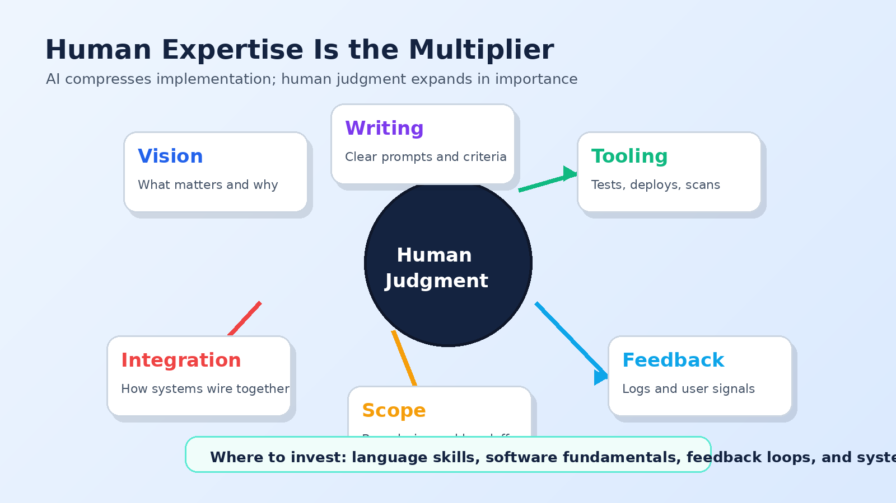

More than any software development lifecycle I have worked in, AI-assisted delivery lends itself to end-to-end automated workflows. It pushes left toward requirements, design, and tests. It pushes right toward deployment, logs, feedback, and iteration.

That sounds like the machines are taking over the whole chain.

They are not.

What I found is that human expertise becomes more important, not less. Different parts of the job get compressed, but the judgment layer gets bigger. With the right skills, ideas can take off very quickly. Like you would not believe. Without those skills, teams can spin in circles and waste tokens with impressive confidence.

## Vision Casting

Vision casting kicks off the whole process. The clearer it is, the faster it comes to life.

A coding assistant can build from a prompt, but it cannot decide what matters to your business. It can infer, but inference is not strategy. It can produce options, but options are not priorities.

The human has to say what the product is for, who it serves, what must be true when it is done, and what tradeoffs are acceptable. That is not fluff. That is the input that shapes every technical decision downstream.

When the vision is vague, the assistant fills gaps. Sometimes well. Sometimes hilariously. Sometimes dangerously.

## Written Communication

Concise language and removing ambiguity are step one.

The next step is understanding how AI receives that communication and what it does with it. Structured formats often work better than prose. Acceptance criteria beat vibes. Examples beat adjectives. A table of constraints beats a paragraph that says "make it enterprise-grade," which is a phrase that has done enough damage already.

Good writing becomes good management. Requirements become prompts. Prompts become work plans. Work plans become code, tests, and deployment steps.

This does not make writing less technical. It makes technical writing operational.

## Software Tooling

Run code. Format it. Test it. Deploy it. Check it for vulnerabilities. Read the logs.

Knowing how to trigger these actions at the right time saves a kingdom of tokens. If the assistant has to invent the validation process from scratch every sprint, you pay for that confusion again and again.

The fundamentals matter: package managers, test runners, linters, type checkers, CI systems, infrastructure tools, release workflows, observability, and security scanning. The assistant can use these tools, but someone needs to make sure the tools exist, are documented, and are wired into the workflow.

No toolchain, no leverage.

## Feedback Loops

Gathering feedback systematically from users and from the system itself becomes a core skill.

AI can assess log files for positive and negative signals. It can summarize error trends. It can connect a user complaint to a likely code path. It can propose tests that reproduce a failure. That is useful only if the feedback is captured in a way the assistant can read and act on.

A complaint in a hallway is not a backlog item. A production error without context is just noise. A log without correlation IDs is a pile of text hoping someone is patient.

The better the feedback loop, the better the assistant can improve the system.

## Managing Scope

Scope management may be the biggest practical skill.

Start with a clear definition. Check back often to make sure the work is still inside that definition. Limit the scope of an agent's memory and processing in systematic ways, very similar to how we limit scope for human developers.

A person with too much responsibility and not enough clarity gets overwhelmed. An agent does too, only faster and with more paragraphs.

Small scopes produce better work. Clear handoffs produce better work. Explicit stopping points produce better work.

This is not new management wisdom. It is old management wisdom with a turbo button.

## Software Integrations

Understanding how components wire together is key to making sure the system thinks about flows correctly.

Data moves from a screen to an API to a database, often changing names and structures along the way. Auth context needs to travel. Errors need to come back in a useful shape. Deployment permissions need to match infrastructure boundaries. Mobile releases do not behave like web releases. Cloud policies do not care that the demo is tomorrow.

When AI finds a bug it cannot troubleshoot, integration knowledge is where the human becomes the real big brain.

Enabling self-diagnostics comes from this skill too. If the system can explain what it is doing, the assistant has something to inspect when it breaks.

## Where to Put Your Money Right Now

This is what I see the technology doing very well, and I boil it down to language skills.

First: writing code. Putting the "language" back in programming language. Python, HTML, Terraform, YAML, SQL, test cases, API contracts. The assistant is strong wherever structured language and patterns dominate.

Second: gap analysis and critical analysis. Believe it or not, it is pretty good. Try it with your personal AI assistant and ask what you are doing wrong. Based on the data you have given it, it will let you know. Sometimes too directly, like it wants a podcast.

Third: technical flow design. How data flows from a screen to an API to a database with different names and structures can be handled well, as long as you instruct the assistant to be systematic.

## The New Shape Is Coming

The skills above are not necessarily part of any single current job description. There are more soft skills, imagination, and abstract thinking needed now. But the fundamentals of software engineering are more important than ever.

Someone will invent a new way to get from idea to deployment, in a shape that does not quite exist yet.

We are not there quite yet.

But we are close enough to start practicing.
