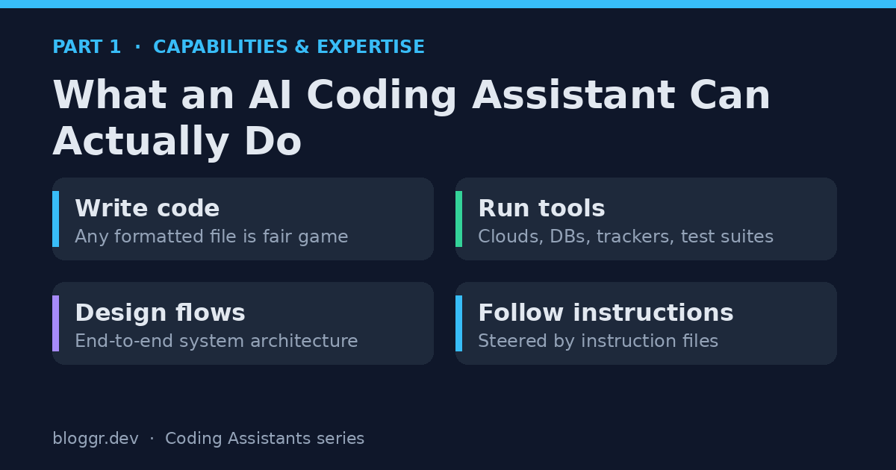

The technology world has turned to AI coding assistants. It's here — it's not "going" to happen, because it already has. Enterprise leaders need to make decisions about who, what, how, and why. You know, the usual suspects of any major decision. This is timely because one of the leading AI model companies recently announced that 80% of its code — critical corporate assets, its very lifeblood in that industry! — is written by AI.

In this post, part 1 of 3, I'm sharing capabilities, limitations, and perspective on the effective management and usage of these tools. The subsequent posts will show the patterns I worked out, and what wrangling an AI assistant looks like in practice.

## What This Series Covers

I want to set expectations up front, because "AI coding assistant" means very different things to different people.

- **Part 1 (this post):** the raw capabilities, and the human expertise that turns those capabilities into outcomes.
- **Part 2:** the orchestration patterns — how to wire multiple agents into a fleet that designs, builds, secures, and ships.
- **Part 3:** wrangling in practice — what I actually built, where it broke, and what I learned managing agents instead of writing code.

If you've never worked with these tools, consider the next section a level set. If you have, skip ahead to where I put the pieces together.

## Teeing Up With Individual Capabilities

First, a note on language: you'll see me use "AI coding assistant" and "AI agent" interchangeably. Most of the time, the capabilities I describe go beyond "an assistant" and into specialized agency — software doing things with knowledge and intention.

### They write code

AI coding assistants can write code, sure. No sweat. Code is just language, after all, and these assistants are backed by some serious large language models (LLMs). But the perspective I'm sharing is that we define far more than web pages with code: back-end APIs, cloud infrastructure, security policy, network configurations, and even other agents. In other words, anything in your technical environment that is expressed in a formatted file, or connected to with an API or tool, is fair game.

### They run tools

Let's build on that, because these are first-class agents. They run tools. Tools exist for just about all of the functions of modern platforms: clouds, databases, issue-tracking systems, quality testing. Some tools are even smart enough to work from screens where no dedicated tool exists. Coding agents can be permitted to run these.

### They design flows

With enough of a clue for input, AI coding assistants can even design end-to-end flows. Based on established patterns — written about by folks like me, sharing their knowledge for free — an LLM can figure out all the system components needed, the role of each component, and how they wire up together.

### They follow instructions (mostly)

I'll tack on "follow instructions" as a capability, though this is where it can get a little wild. These tools are built to start up and look for instruction files as their guide. Instructions can steer the flow of events: that code must be tested before going to the next step, that every decision should be logged to a file, that a regression test must accompany every bug fix.

Compliance depends on how well aligned the instructions, as written, are to the tasks the assistant actually encounters. Well-written instructions fire when the same thing happens in different contexts. For example: *always write a regression test when a bug is fixed.* But do you mean bugs that **you** find, bugs the **assistant** finds, or both? That ambiguity is the difference between an instruction that holds and one that quietly lapses.

## Where to Put Your Money Right Now

Before we talk about people, here's what I see the technology doing very well today. I boil it down to language skills.

- **Writing code.** Putting the "language" back in programming language. A natural fit for Python and HTML, but also for Terraform.
- **Gap analysis and critical analysis.** Believe it or not, it's pretty good. Try it with your personal AI assistant: ask what you're doing wrong. Based on the data you've given it, it'll let you know.
- **Technical flow design.** How data moves from a screen to an API to a database — with different names and structures along the way — is handled well, as long as you instruct it to be systematic.

## Human Expertise in the Loop

Projecting what I found in my experimentation into the real world uncovers roles and skills that become *even more* important. With these skills, ideas take off quickly — like you wouldn't believe. Without them, people spin in circles and waste tokens.

- **Vision casting.** This kicks off the whole process. The clearer it is, the faster it comes to life.
- **Written communication.** Concise language and removing ambiguity are step one. Understanding how AI receives that communication — and what it does with it — is the real skill. AI reads structured formats more easily than prose.
- **Software tooling.** Run code, format it, test it, deploy it, scan it for vulnerabilities. Knowing how to trigger these at the right moment — without having your AI design them from scratch each time — saves a kingdom of tokens.
- **Systematic feedback.** Gather it from users *and* from the system itself, then feed it back into improvements and fixes.
- **Managing scope.** Start with a clear definition and check back constantly to make sure you're still on it. Limit the scope of an agent's memory and processing the same way you'd limit it for a human developer.
- **Software integration.** Understanding how components wire together is what lets you reason about flows correctly — and be the big brain when the agent hits a bug it can't troubleshoot. Self-diagnostics grow out of this skill, too.

These skills aren't necessarily part of any single current job description. They lean on soft skills, imagination, and abstract thinking. But the fundamentals of software engineering matter more than ever. Someone will invent a new way to get from idea to deployment — a new shape that doesn't exist yet — but we're not quite there.

## Up Next

In [Part 2](), I'll show how these individual capabilities snap together into a working pipeline: a coordinator, a red team, builders, critics, and a deployment agent — with feedback loops that let the system improve itself.

---

*This is Part 1 of a three-part series on working with AI coding assistants as if you were shipping enterprise software.*
