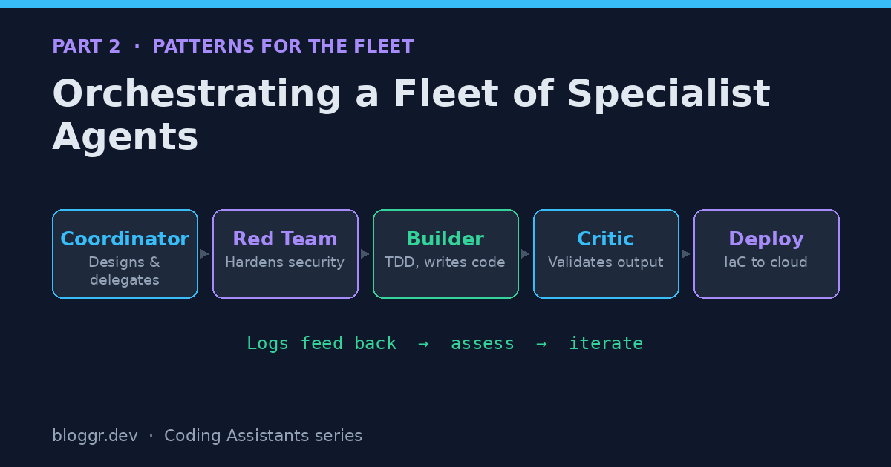

In [Part 1](), I laid out what a single AI coding assistant can do: write code, run tools, design flows, and follow instructions. Each of those is useful on its own. But the real leverage shows up when you stop thinking about *an assistant* and start thinking about *a fleet*.

This post is about putting the capabilities together — first as a flow, then as the reusable frameworks I built around it.

## Putting Capabilities Together

You've probably already connected the dots, so I'll sum it up as a pipeline:

1. Give the AI coding assistant rules and procedures.
2. In a standard way, describe your ideas to AI as flows of interaction between a user and the system.
3. AI does the technical design and parcels out work between code repositories — one per layer.
4. A **Red Team** agent iterates with the designer to identify cybersecurity risks and fix them.
5. AI builds and tests against the specs.
6. A **Critic** agent validates that the coding agent actually did what it was supposed to.
7. A **deployment** agent ships each repo: cloud, API, web, and so on.
8. AI assesses log files for positive and negative feedback — and the loop begins again.

That's the whole arc: design, harden, build, validate, deploy, learn. The diagram above is the same flow, left to right.

## A Few Keywords That Carry Big Meaning

Some terms in that pipeline do a lot of work. They're worth defining plainly, because they're borrowed from disciplines that predate the current AI wave.

- **Red Team.** From cybersecurity: a team that finds security issues and proposes resolutions or mitigations. An iterative loop between a Red Team agent and a Designer agent hardens a design *before* code is written, which is the cheapest possible place to fix a vulnerability.
- **TDD (Test-Driven Development).** This little buzzword makes your coding agent design the test *before* it writes the code. In real life, TDD kept us from skipping automated testing — and it had the surprising benefit of speeding up delivery, because the target and its ambiguities were better understood up front. Agents benefit the same way.
- **Critic.** A Critic agent evaluates what something *should* be versus what it *is*, and delivers candid, direct feedback — like it's auditioning for a podcast. Honest critique is hard to get from a single agent grading its own homework; a separate critic breaks that conflict of interest.
- **Infrastructure as Code (IaC).** Instead of issuing ad-hoc commands, IaC lets LLMs use language to define cloud resources, then deploy them with basic, repeatable tool-execution patterns. It turns "deployment" into just another file the agent can write and reason about.

## Four Reusable Frameworks

Over a couple of months of zealous experimentation, I created four reusable frameworks for the different scenarios I kept running into. I kept iterating, and they kept getting better. They're still rough — at minimum I'll share the concepts, even if the implementations aren't drop-in reusable yet.

### 1. The Single-Repo Script

For a small app with a single repository, this might be no more than a script. Define the sprint in `.github/copilot-instructions.md` and tell the agent to follow an `OPERATOR_RUNBOOK.md`. Prompt it with some boilerplate carrying the sprint goals and acceptance criteria — as if you were an Agile scrum master kicking off the iteration.

It's the lightest-weight pattern, and a great place to start before you reach for anything fancier.

### 2. The Enterprise Copilot Fleet Controller

For an app with multiple repositories — one per layer — I built what I called the **Enterprise Copilot Fleet Controller**. One agent coordinates and designs, with access limited to design artifacts and work items. Many specialist agents write code and deployment procedures. Critics are everywhere, keeping everyone in check, just like in real life.

The key design choice here is **access scoping**: the coordinator can't write code, so it can't be tempted to. It has to delegate.

### 3. The Submodule Parent

An alternative for the same multi-repo, one-layer-per-repo situation: a parent repository tracks the layers' repositories as git submodules and has read access to all of them.

This one taught me a lesson. Keeping scope limited for token-count reasons was challenging, and the coordinator agent tended to **micromanage** — doing work itself instead of delegating. The costs land on quality and effort: with that much scope, the coordinator gets overwhelmed. (Any managers in the room feeling that right now?) It still churned through many sprints successfully before falling down — but the failure mode is instructive.

### 4. Custom Deterministic Workflows

This one isn't really working yet. I had AI design and write workflows that I then delivered, but implementing all the details will take more time. The promise is **deterministic gates** that hand temporary control to otherwise indeterministic agents — a way to bolt predictable checkpoints onto unpredictable workers. Not there yet, but I think it's where a lot of this is heading.

## Why This Pushes Left and Right

More than any software development lifecycle I've done, this approach lends itself to end-to-end automated workflows. It pushes back to the left — into design, security, and requirements — and out to the right — into deployment and feedback. The agents don't get tired of the unglamorous parts, so the parts of the lifecycle we used to skip finally get done.

## Up Next

Frameworks are theory until they meet a real project. In [Part 3](), I'll show what I actually built with these patterns — three real applications, zero lines of hand-written code — and the break-fix loops that taught me how to manage an agent instead of out-coding it.

---

*This is Part 2 of a three-part series on working with AI coding assistants as if you were shipping enterprise software.*
