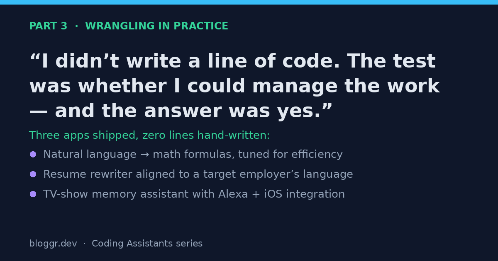

In [Part 1]() I covered capabilities and human expertise. In [Part 2]() I covered the orchestration patterns. This post is the part everyone actually wants: what happened when I pointed all of it at real projects.

## The Test I Set for Myself

Over the last couple of months I've been zealously figuring out how best to work with these tools — as if I were writing enterprise or commercial software. But I didn't write any code. Not a line. That was the test:

> Can GitHub Copilot write code that maintains high quality, adheres to standards, takes actions that are traceable and auditable, and follows a logical workflow?

Yes. Not to understate it, but: yes. It takes a good manager, but yes. It was exhausting — 15-minute follow-ups rather than the daily standups a people-manager would have — but yes.

## What My Role Actually Was

My job wasn't to write software. It was to set up the coding assistants to write it well. Concretely, I:

- **Communicated the flow** from the user's perspective, so the system was designed around real interactions rather than abstract features.
- **Wrote system requirements** and made the assistant refer back to them, so "done" had a definition.
- **Handled the no-tool tasks** myself — things like logging in to the Apple and Google developer sites, where there's no API for an agent to drive.
- **Steered when things broke.** When the AI couldn't fix something quickly, I reviewed the code and the log files, then redirected it.

Notice that none of those are coding tasks. They're management, communication, and judgment tasks. That's the shift.

## Three Things I Built

The outcomes ranged from fully functional to almost-there-but-stuck-in-a-break-fix-loop until I stepped back to look at my *approach* rather than the code. Here's what came out of it:

### 1. A natural-language math engine

An application that translates natural language into math formulas, runs them, and tunes for efficiency. Stack: web firewall, website, agent, and tools. This one leaned hard on the "design flows" capability — the agent had to reason about correctness *and* performance.

### 2. A resume rewriter

An application that analyzes a resume against a job description and rewrites it in the language of the target employer. Stack: web firewall, website, Android app, API, database, and an agent. The interesting challenge here was multi-surface consistency — the same logic exposed through web and mobile.

### 3. A TV-show memory assistant

An application that remembers what TV shows I was streaming. Stack: web firewall, website, Android app, Alexa integration, iOS app, and a database. This was the most integration-heavy of the three — and integration is exactly where a human still has to be the big brain when something won't reconcile.

## What the Break-Fix Loops Taught Me

When a project got stuck, the problem was almost never that the agent "couldn't code." It was that *my* inputs were ambiguous, or the scope had crept, or the agent was micromanaging itself instead of delegating (see the submodule framework in Part 2). The fix was usually to step back and change my approach, not to dive into the code.

A few lessons crystallized:

- **Ambiguity is the enemy.** Every vague requirement eventually becomes a wrong implementation, confidently delivered.
- **Scope is a leash, not a cage.** Limit what each agent can see and touch. An overwhelmed coordinator produces worse work, just like an overwhelmed person.
- **Logs are your standup.** When you can't ask the agent "how's it going?", well-structured logs are how you find out — and how the system feeds its own improvements.
- **Stepping back beats pushing harder.** The longest loops ended the moment I stopped debugging the output and started debugging my instructions.

## Where This Leaves Us

The skills that made this work aren't neatly contained in any single job description today. They demand more soft skills, more imagination, and more abstract thinking than we're used to asking for. But the fundamentals of software engineering matter *more* than ever — because someone has to cast the vision, define the scope, and be the big brain when the system gets stuck.

Someone will invent a new way to get from idea to deployment, in a shape that doesn't exist yet. We're not quite there. But after three apps and zero hand-written lines, I'm convinced the role of the engineer is changing from *author* to *director* — and that's a role worth getting good at now.

---

*This concludes the three-part series on working with AI coding assistants as if you were shipping enterprise software. Start over at [Part 1]().*
